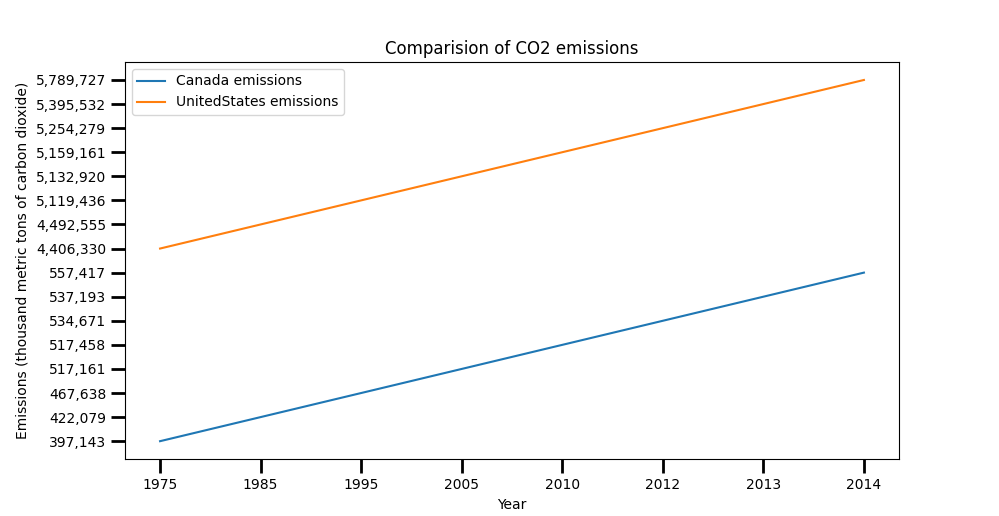
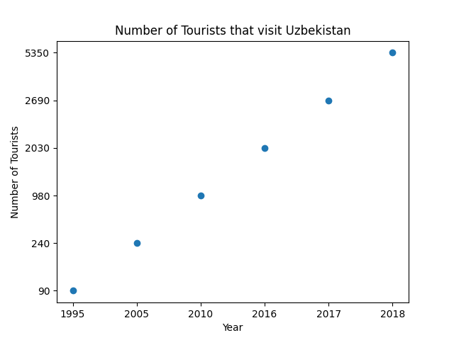

# HW02: Working with UNdata CSV files 

Go look at the project page!'[hw02](https://github.com/mikeizbicki/cmc-csci040/tree/2020fall/hw_02)'

**Comparision of COS emissions: US and Canda**

This first plot looks at the CO2 emissiosn from the US and Canda. The data starts from 1975 up to 2014. 

Here is the link to original data source!'[DATA](http://data.un.org/)'

**Uzbekistan Tourist Visitors**

This second plot shows a trend in the number of tourist visitors that go to Uzbekistan. The data starts from 1995 up to 2018. 

Here is the link to original data source!'[DATA](http://data.un.org/)'